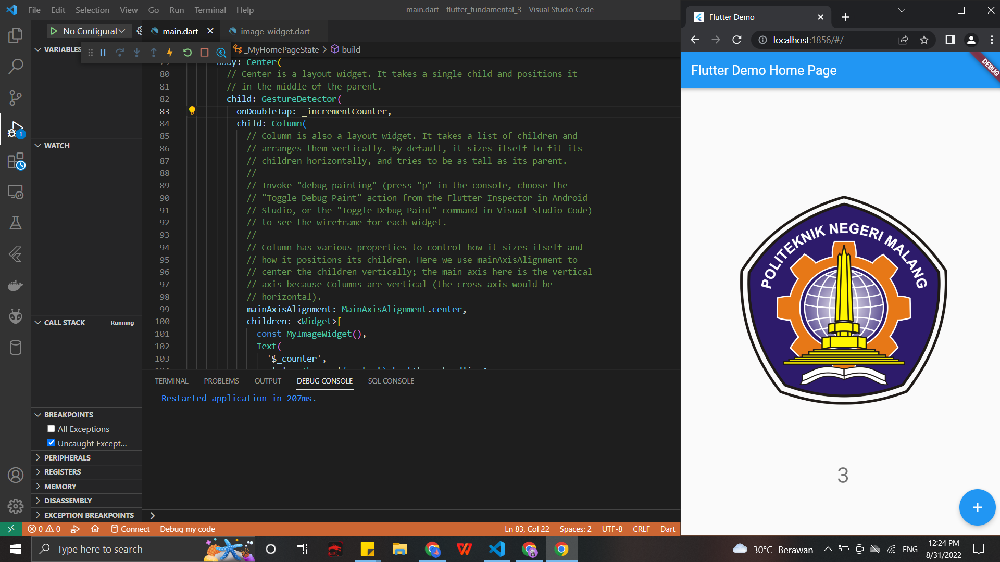
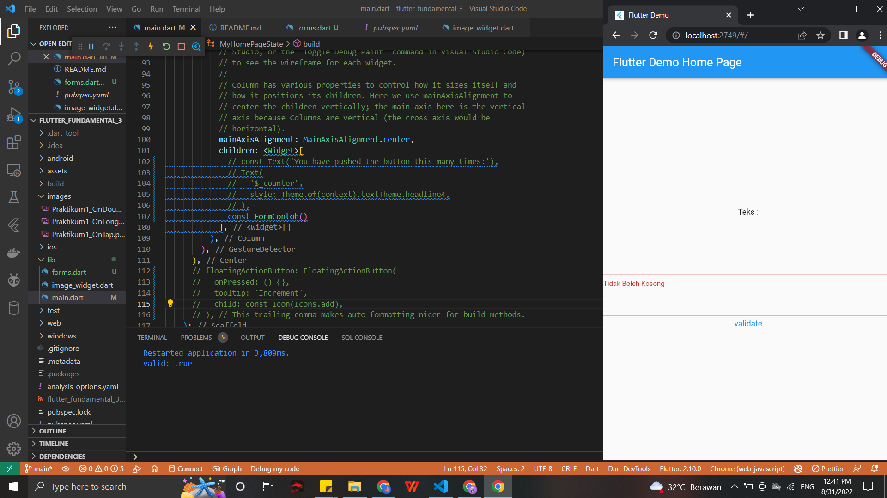
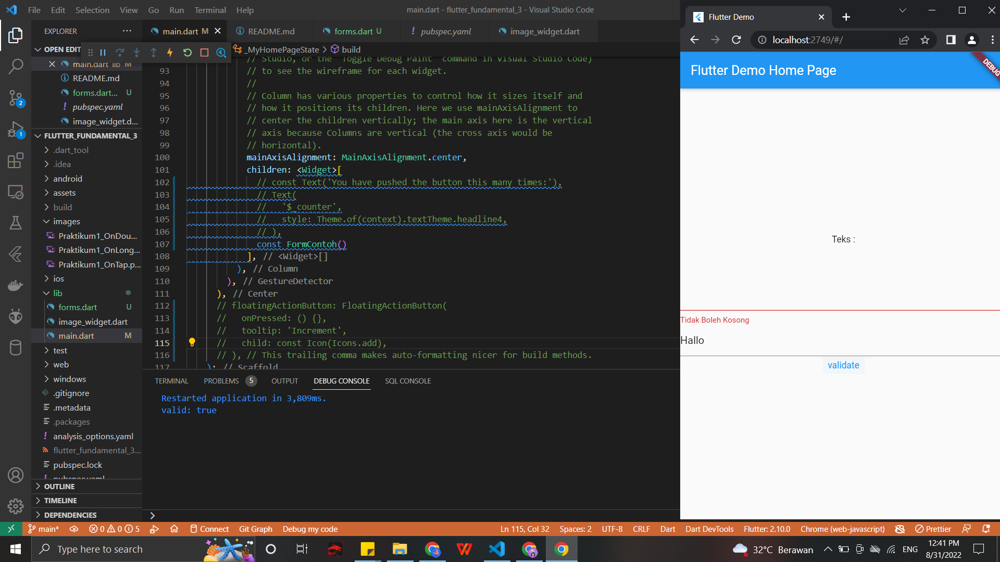

# flutter_fundamental_3

#18 | Flutter Fundamental - Bagian 3

Praktikum 1: Menerapkan Gesture Detector
- On Tap: Mengklik hanya satu kali

- On Double Tap: Mengklik 2 kali

- On Long Press: Menahan beberapa detik

Praktikum 2: Menerapkan Input Widget dan Forms
- Validasi inputan sangat bermanfaat untuk pengisian sebuah forms, pembuat aplikasi bisa menyesuaikan value apa yang ingin di input ke dalam forms tersebut.
- Jika tidak sesuai maka akan ada pemberitahuan. Contohnya jika inputan dibiarkan kosong, maka akan muncul warning seperti pada contoh praktikum ini.

